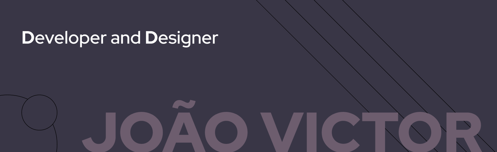

"I learn code to solve problems"

### Bem vindo ao meu perfil 😅

## Meu portifólio

https://portifoliogallery.web.app

## Minhas Habilidades e Tecnologias

Principais Habilidades:

Também posso entregar:

Estudando no momento:

## Redes Sociais

